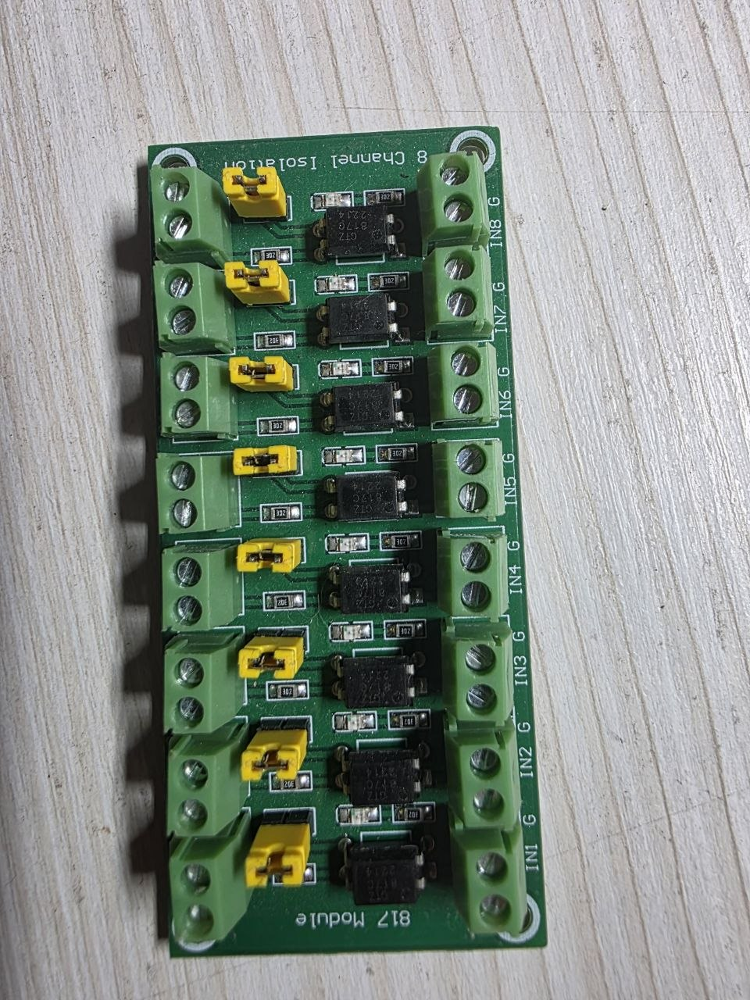
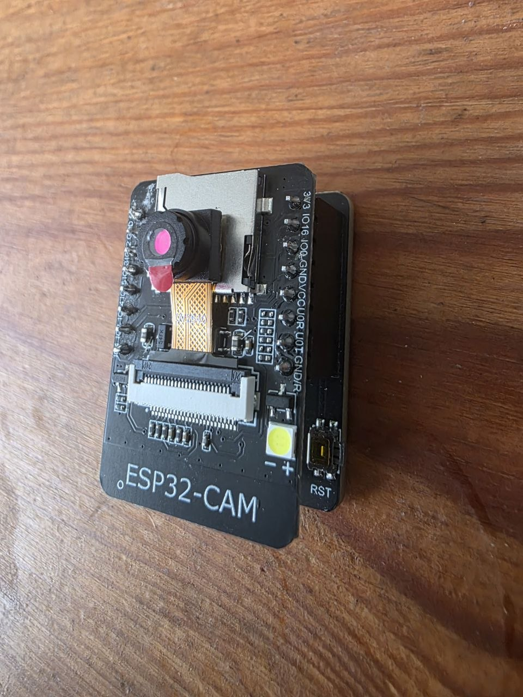
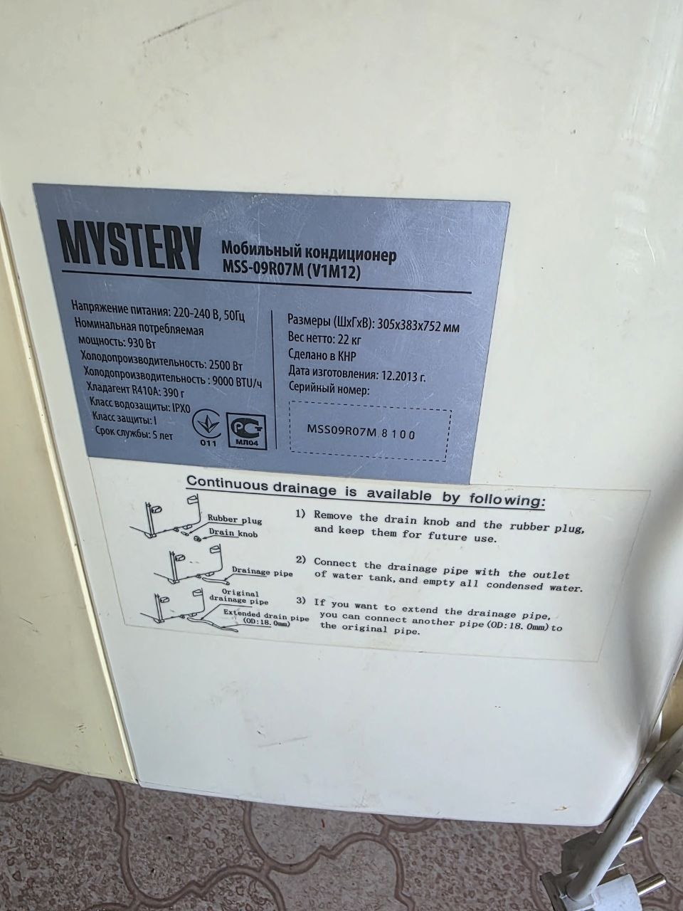
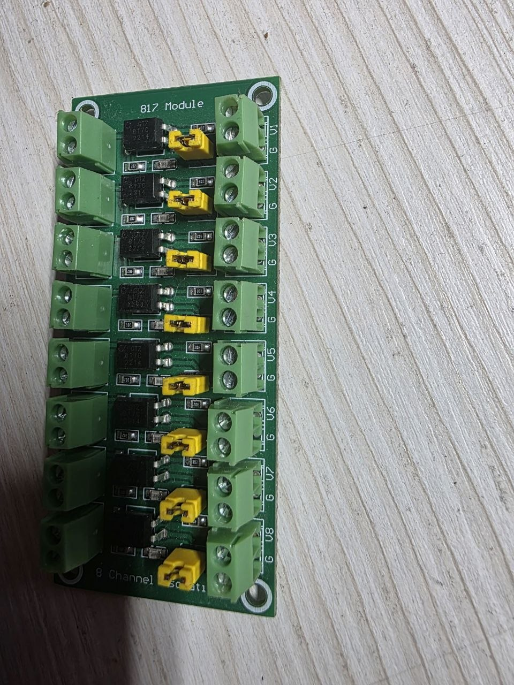

# AC Automation — Mystery MSS-09R07M

Автоматизация мобильного кондиционера Mystery через ESP32-CAM + модуль оптоизоляции PC817.

## Железо

| Компонент | Назначение |
|-----------|------------|
| ESP32-CAM | Контроллер + Wi-Fi + опциональная камера |
| 8-канальный модуль PC817 | Оптоизоляция кнопок панели управления |
| DHT22 | Датчик температуры и влажности |
| Mystery MSS-09R07M | Мобильный кондиционер 9000 BTU |



## Почему PC817 лучше BC547

- ✅ Гальваническая развязка — ESP32 физически изолирован от схемы кондея
- ✅ Безопаснее — нет риска пробоя на контроллер
- ✅ Не нужны отдельные резисторы на каждую кнопку
- ✅ 8 каналов = хватит на все кнопки панели

## Возможности (план)

- Управление кнопками через HTTP API / MQTT
- Мониторинг температуры и влажности (DHT22)
- Интеграция с Home Assistant
- Управление через Telegram-бот
- Автоматизация по расписанию / по температуре

## Структура

```
firmware/     — прошивка ESP32 (Arduino)
hardware/
  photos/     — фотографии компонентов и схем
docs/
  hardware.md — детальное описание железа и подключения
```

## Статус

🚧 В разработке — изучение панели управления кондея

## Фото компонентов

| ESP32-CAM | Модуль PC817 |
|-----------|--------------|
|  |  |


